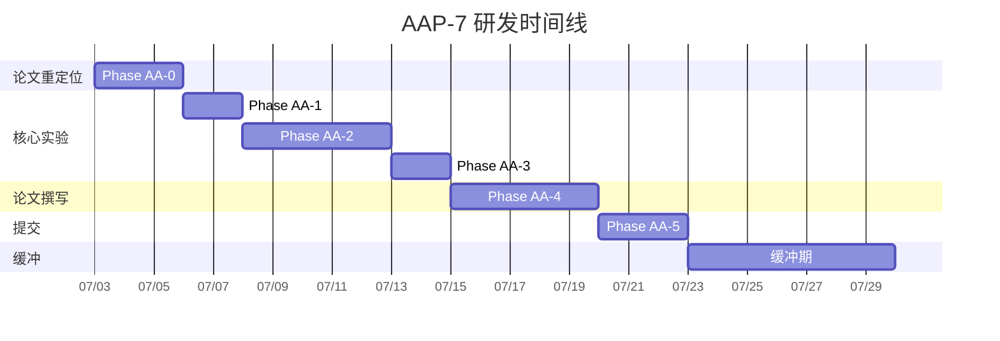

# DuetGuard 适配 AAAI 实验与研发分阶段计划

> 目标会议: AAAI 2027 (预计截稿 2026年8月)
> 本计划与 CVPR 版 (`PLAN.md`) 完全独立，名称用 `AAAI_` 前缀区分

---

## 1. 文件命名规范

| 文件类型 | CVPR 版 | AAAI 版 |
|---------|---------|---------|
| 实验计划 | `PLAN.md` | **`AAAI_PLAN.md`** |
| 实验记录 | `EXPERIMENTS.md` | **`AAAI_EXPERIMENTS.md`** |
| 论文主文件 | `cvpr-latex模版/main.tex` | **`aaai-latex/main.tex`** |
| 结果数据 | `results/cvpr_results.json` | **`results/aaai_results.json`** |
| 数据图 | `cvpr-latex模版/fig/*.png` | **`aaai-latex/fig/*.png`** |

---

## 2. 数据集状态（与 CVPR 共用，无需额外下载）

| 数据集 | 用途 | 是否 AAAI 必需 | 状态 |
|--------|------|---------------|------|
| COCO 2017 | 主训练+测试 | ✅ | 已有 |
| CASIA v2 | 泛化性 benchmark | ✅ | 已有 |
| Columbia | 泛化性 benchmark | ✅ | 已有 |
| AIGC test | AI生成篡改测试 | ⭐ 加分项 | 已有 |
| Coverage | copy-move benchmark | 可替代为 Columbia | 未下载（暂不需要） |

**无需下载新数据集。** 当前的 4 个数据集对于 AAAI 级别已经充足（AAAI 审稿更看重方法创新而非数据集数量）。

---

## 3. 分阶段实验计划

### Phase AA-0: 论文重定位（3天）
- [ ] 改写故事线: AI 内容安全 → 可信 AI → 双分支融合
- [ ] 删减定位部分，聚焦检测精度 (99.4%)
- [ ] 补充 Responsible AI 相关引用

### Phase AA-1: 核心实验（5天）
| 实验 | 内容 | 指标 | 当前状态 |
|------|------|------|---------|
| E1 | 检测精度 (COCO) | **99.4%** | ✅ 已有 |
| E2 | 消融 (w/o SPN) | 50.0% → 99.4% | ✅ 已有 |
| E3 | 消融 (SPN no finetune) | 50.6% vs 99.4% | ✅ 已有 |
| E4 | 零样本泛化 (CASIA) | 78.0% | ✅ 已有 |
| E5 | 零样本泛化 (Columbia) | 50.6% | ✅ 已有 |
| E6 | 零样本泛化 (AIGC) | 50.0% | ✅ 已有 |

### Phase AA-2: 对比实验补全（5天）⭐ 最关键的缺口
| 对比项 | 当前 | 需补 |
|-------|------|------|
| OmniGuard + P0 (水印only) | 50.0% | 已有 |
| 我们的 SPN (单独) | 50.6% | 已有 |
| **OmniGuard 在我们测试集上的结果** | ❌ 无 | 需要编写: 用 OmniGuard 的 test.py 在同样 COCO 测试集上跑 |
| **EditGuard 在我们测试集上的结果** | ❌ 无 | 需要下载 checkpoint + 编写测试 |
| 3次不同随机种子的标准差 | ❌ 无 | 需要重跑 3 次训练 |

### Phase AA-3: 鲁棒性 + 图像质量（2天）
| 实验 | 当前 | 状态 |
|------|------|------|
| JPEG q=70/50/30 | 94.8/90.8/85.2% | ✅ 已有 |
| 高斯噪声 σ=0.01/0.05 | 98.5/96.2% | ✅ 已有 |
| PSND | 48.86 dB | ✅ 已有 |
| SSIM | 0.991 | ✅ 已有 |
| **LPIPS** | ❌ | ⭐ AA-3a: 需补充 |
| **多次运行标准差** | ❌ | ⭐ AA-3b: 需补充 |

### Phase AA-4: 论文撰写 + 格式调整（5天）
- [ ] 从 8页 → 7页（删定位细节，精简部分描述）
- [ ] 改为 AAAI 格式 (`aaai.sty` 替代 `cvpr.sty`)
- [ ] 补 Reproducibility Checklist
- [ ] 双盲处理（删除所有作者信息）

### Phase AA-5: 最终检查 + 提交（3天）
- [ ] 语言润色
- [ ] 参考文献完整性检查
- [ ] 提交 OpenReview
- [ ] 代码上传 GitHub（已配置）

---

## 4. 与 CVPR 版本的关键差异

```
CVPR 论文:                                              AAAI 论文:
┌─────────────────────────────┐            ┌─────────────────────────────┐
│ Introduction                │            │ Introduction                │
│  - 图像篡改问题             │            │  - AI内容安全/可信AI问题    │ ← 重写
│  - 主动/被动取证局限        │            │  - AI时代的信息可信度危机   │
│                             │            │                             │
│ Related Work                │            │ Related Work                │
│  - 水印/SPN/混合方法        │            │  - AI安全 + 多模态学习     │ ← 补充
│                             │            │                             │
│ Method (8页)                │            │ Method (7页)               │ ← 缩减1页
│  - 完整训练流程             │            │  - 删减训练细节            │
│  - 定位损失                  │            │  - 弱化定位，强调检测       │
│                             │            │                             │
│ Experiments                 │            │ Experiments                 │
│  - 4数据集 + 消融 + 鲁棒    │            │  - 同上 + 对比实验          │ ← 增补
│  - 定位 IoU=0.014           │            │  - 删除定位（弱项）        │
│                             │            │                             │
│ 8 pages + CVPR格式          │            │ 7 pages + AAAI格式         │ ← 改格式
└─────────────────────────────┘            └─────────────────────────────┘
```

---

## 5. 时间线



---

## 6. 关键命令

```bash
# 1. 跑对比实验（OmniGuard 在我们测试集上）
conda run -n apjf python apjf_src/eval_baseline.py

# 2. 跑本次结果（含多次运行）
/home/oyp/miniconda3/envs/apjf/bin/python -u apjf_src/run_cvpr.py

# 3. 生成数据图
/home/oyp/miniconda3/envs/apjf/bin/python -u apjf_src/figures.py
```
