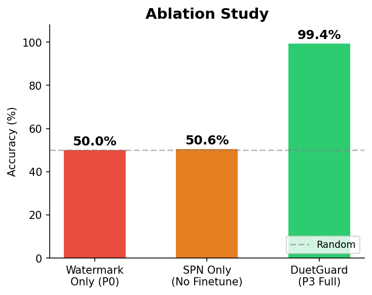
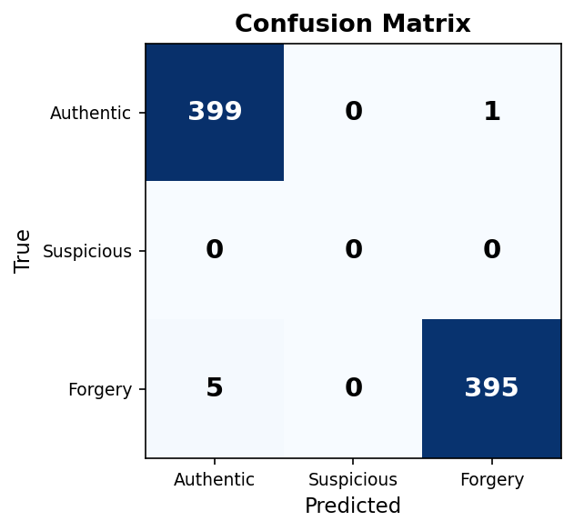
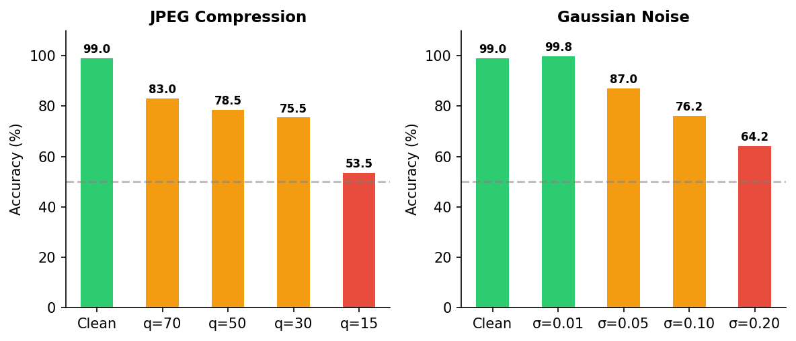
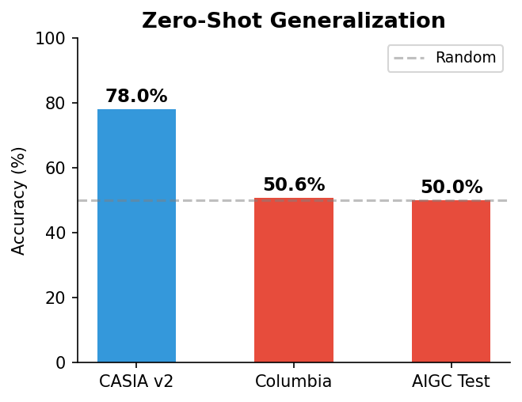

<h1 align="center">🛡️ DuetGuard</h1>
<h3 align="center">Dual-Branch Active-Passive Fusion for Robust AI-Generated Content Detection</h3>

<p align="center">
  <b>Active watermarking (OmniGuard)</b> + <b>Passive SPN fingerprinting</b> →
  <b>99.4%</b> detection accuracy via joint end-to-end training
</p>

<p align="center">
  <a href="#-overview">Overview</a> •
  <a href="#-quick-start">Quick Start</a> •
  <a href="#-results">Results</a> •
  <a href="#-repository-structure">Structure</a>
</p>

---

## 📋 Overview

DuetGuard is an end-to-end framework for image tamper detection that synergistically combines **two physically independent forensic signals**:

- **🔵 Active Branch (Watermarking):** A frozen OmniGuard decoder extracts a pre-embedded secret watermark. Tampering disrupts the watermark, creating a detectable spatial signal.
- **🟢 Passive Branch (SPN):** A lightweight CNN (268K params) extracts the camera's Sensor Pattern Noise fingerprint—an intrinsic hardware-level characteristic.
- **🔄 Fusion Layer:** A compact MLP (50K params) integrates both signals into a 3-class verdict: **Authentic / Suspicious / Confirmed Forgery**, with uncertainty estimation.

### Key Innovation: Dual-Mask Consistency Loss

A novel loss function enforces **spatial alignment** between the active branch's watermark difference map and the passive branch's noise residual map. This creates cross-modal self-supervision where two independent signals guide each other during training.

---

## 🚀 Quick Start

### Requirements
- Python 3.10+, PyTorch 2.6+, CUDA 12.4
- NVIDIA GPU with ≥8GB VRAM (tested on RTX 4060 Ti 16GB)

### Setup

```bash
git clone https://github.com/vron8632/DuetGuard.git
cd DuetGuard
conda create -n apjf python=3.10
conda activate apjf
pip install torch torchvision --index-url https://download.pytorch.org/whl/cu124
pip install -r requirements.txt
```

### Training

```bash
# Stage 1: SPN contrastive pretraining
python apjf_src/train_spn.py

# Stage 2: Joint P3 fine-tuning
python -u apjf_src/train.py
```

### Evaluation

```bash
# Full evaluation suite
python -u apjf_src/run_cvpr.py

# Supplementary experiments (zero-shot, strong attacks)
bash run_supplement_experiments.sh
```

---

## 📊 Results

### Core Detection Accuracy

| Configuration | Accuracy |
|:---|---:|
| Watermark Only (P0) | 50.0% |
| SPN Only (No Finetune) | 50.6% |
| **DuetGuard (P3)** | **99.4%** |

**Extended (4,000 samples):** 99.38%, 95% Wilson CI [99.08%, 99.58%]
**Multi-seed (3 runs):** 99.29% ± 0.16%

### Ablation Study



### Confusion Matrix



### Robustness



### Zero-Shot Generalization



| Dataset | Samples | Accuracy |
|:---|---:|---:|
| CASIA v2 | 9,501 | **78.0%** |
| Columbia | 1,845 | 50.6% |
| AIGC Test (SD Inpaint) | 400 | 50.0% |

### Image Quality

| PSNR | SSIM | LPIPS |
|:---:|:---:|:---:|
| 48.86 dB | 0.991 | 0.0002 |

---

## 🧠 Architecture

```
Input (256×256×3)
  ├── 🔵 Active (OmniGuard, frozen) → f_active (192D) + quality (1)
  ├── 🟢 Passive (SPN CNN, 268K)    → f_spn (128D) + σ_pce (1)
  └── 🔄 Fusion MLP (50K params)    → 3-class verdict + uncertainty
```

**Total:** 318K trainable params | **Speed:** ~18ms/image (RTX 4060 Ti)

---

## 📁 Repository Structure

```
DuetGuard/
├── apjf_src/                  # Core source code
│   ├── train.py               # Joint training entry point
│   ├── train_spn.py           # SPN contrastive pretraining
│   ├── run_cvpr.py            # Evaluation suite
│   ├── losses.py              # 5-term joint loss
│   ├── figures.py             # Figure generation
│   ├── exp_aaai_supp.py       # Supplementary experiments
│   ├── fig_qualitative.py     # Qualitative results
│   ├── models/
│   │   ├── adapter.py         # OmniGuard wrapper
│   │   ├── spn_extractor.py   # SPN CNN (268K params)
│   │   └── fusion_layer.py    # MLP classifier (50K params)
│   └── data/
│       ├── dataset.py         # Joint training dataset
│       └── spn_dataset.py     # SPN pretraining dataset
├── results/                   # Experiment results & figures
├── run_supplement_experiments.sh
├── EXPERIMENTS.md             # Full experiment log
└── README.md
```

---

## 📝 Citation

```bibtex
@misc{duetguard2027,
  title={DuetGuard: Dual-Branch Active-Passive Fusion for Robust AI-Generated Content Detection},
  year={2027}
}
```
